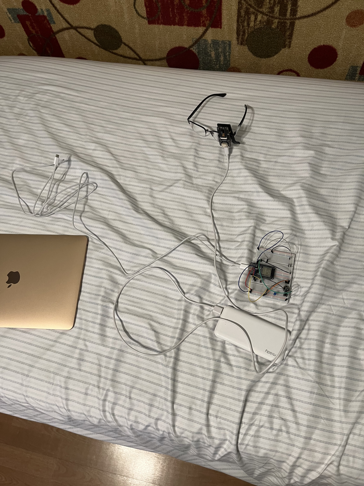

# Meta-Glasses-but-better

A DIY wearable AI assistant. Clip a camera and microphone to a pair of glasses,
press a button, and ask a question out loud. An ESP32 captures a photo of what
you're looking at plus five seconds of audio, streams both to your computer, and
a multimodal LLM answers, out loud, in the voice of an over-enthusiastic anime
sidekick.

It's a scrappy, breadboard-and-power-bank take on smart glasses: camera + mic +
ESP32 on the frames, all the heavy lifting done by [OpenRouter](https://openrouter.ai/)
(Gemini) for understanding and [ElevenLabs](https://elevenlabs.io/) for speech.

## Demo

The full rig: glasses with an ELEGOO camera module clipped to the frame, an
ESP32 on a breadboard, a power bank, and a laptop receiving the capture over USB.



## How it works

One button press kicks off a full capture-and-answer cycle:

1. **Capture**: pressing the button on the ESP32 makes it request a photo from
   the camera (over Wi-Fi) and record 5 seconds of audio from the microphone.
2. **Stream**: the ESP32 streams the JPEG and the raw audio to your computer over
   USB serial using a small binary marker protocol.
3. **Reconstruct**: the Python host reassembles the bytes into a `.jpg` and a
   `.wav`, saved under `captures/`.
4. **Understand**: it sends the image and audio together to Gemini (via
   OpenRouter). The model listens to your spoken question, uses the photo as
   visual context, and replies.
5. **Speak**: the reply is sent to ElevenLabs for text-to-speech and played back
   through your speakers.

## Hardware

- **ESP32** dev board (the brain, talks USB serial to your computer)
- **ELEGOO camera module** with its own Wi-Fi access point (the ESP32 connects to
  it and pulls snapshots over HTTP)
- **INMP441** I2S MEMS microphone
- A **push button** (capture trigger) and an **LED** (status indicator)
- A breadboard, jumper wires, and a USB power bank to make it wearable

Default pin map (from `esp32_capture.ino`): I2S mic on `WS=15`, `SCK=14`,
`SD=32`; button on `13`; LED on `5`.

## Architecture

```
ELEGOO camera (Wi-Fi AP)          ESP32                    Computer (Python host)
        │  HTTP GET /capture        │                              │
        └──────── JPEG ────────────▶│                              │
                                    │──── USB serial (marker) ────▶│  photo_*.jpg
        INMP441 mic ──── I2S ──────▶│──── USB serial (PCM) ───────▶│  audio_*.wav
                                    │                              │
                                    │                              ├──▶ OpenRouter (Gemini)
                                    │                              └──▶ ElevenLabs TTS ──▶ speaker
```

### Firmware (`esp32_capture.ino`)

The Arduino sketch runs the wearable side:

- **Setup**: initializes the I2S microphone, then connects to the ELEGOO
  camera's Wi-Fi access point, blinking the LED until it's connected.
- **On button press**: it drives the LED on for the whole capture, then runs two
  steps back to back.
- **`captureAndSendPhoto`**: opens a TCP connection to the camera at
  `192.168.4.1`, sends `GET /capture`, parses the `Content-Length`, and streams
  the JPEG out over USB serial framed by a 4-byte marker (`0xFF 0xAA 0xBB 0xCC`)
  plus a 4-byte big-endian length. If the camera doesn't send a length, it
  buffers up to 100 KB and sends that instead.
- **`recordAndSendAudio`**: records `RECORD_SECONDS` (5 s) at 16 kHz from the I2S
  mic, applies a fixed gain and clips to 16-bit range, and streams the samples
  after a text header (`AUDIO_START:<rate>:<samples>`), finishing with
  `AUDIO_END`.

### Host script (`main.py`)

The Python program on your computer drives everything downstream:

- **`listen`**: reads the serial stream byte by byte, watching for the image
  marker to switch into binary image mode and otherwise accumulating text lines
  (like the `AUDIO_START` header). It tracks the latest image + audio pair and,
  once both are in, fires the LLM request.
- **`_receive_image` / `_receive_audio`**: reconstruct the JPEG and write the PCM
  into a proper `.wav` (mono, 16-bit) under `captures/`.
- **`_send_to_gemini`**: base64-encodes the image and audio into an
  OpenAI-compatible multimodal message and POSTs it to OpenRouter with a system
  prompt that defines the cheerful, anime-styled assistant persona. The model is
  `google/gemini-3-flash-preview`.
- **`_speak`**: sends the reply to ElevenLabs (voice "Deku", `eleven_turbo_v2`)
  and plays the returned MP3 with macOS `afplay`.

If no `OPENROUTER_API_KEY` is set, captures are still saved to disk but the
analysis step is skipped.

## Setup

### 1. Flash the ESP32

Open `esp32_capture.ino` in the Arduino IDE with ESP32 board support installed.
Update the camera access point credentials (`cameraAP_SSID` / `cameraAP_PASS`)
and the pin defines if your wiring differs, then flash the board.

### 2. Python host

The host needs Python 3 with `pyserial`, `requests`, and `python-dotenv`:

```sh
pip install pyserial requests python-dotenv
```

Create a `.env` with your keys:

```env
OPENROUTER_API_KEY="sk-or-v1-your-key"
ELEVENLABS_API_KEY="your-elevenlabs-key"
```

Then update `USB_COM_PORT` in `main.py` to match your board (the script prints
the available serial ports on startup), close the Arduino Serial Monitor so the
port is free, and run:

```sh
python main.py
```

Press the button on the ESP32 to capture and get a spoken answer.

> **Note**: playback uses macOS `afplay`, so TTS output is macOS-specific as
> written. On other platforms, swap the `afplay` call in `_speak` for your
> platform's player (e.g. `ffplay`, `aplay`, or `paplay`).

## Project structure

```
Meta-Glasses-but-better/
├── esp32_capture.ino   # ESP32 firmware: camera fetch + I2S audio + serial streaming
├── main.py             # Host: serial receiver, Gemini (OpenRouter) call, ElevenLabs TTS
├── LICENSE
└── assets/             # README photo
```

## License

Released under the [MIT License](LICENSE).
